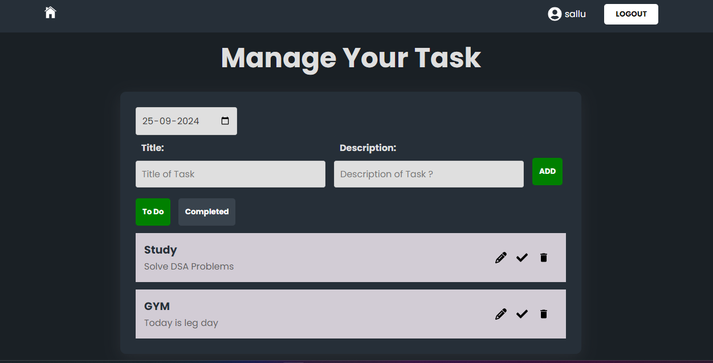

# Task Management Application

A simple task management application built using the MEAN stack (MongoDB, Express.js, Angular, and Node.js). The application allows users to register, log in, create tasks, update tasks, mark tasks as complete, and delete tasks. It provides a user-friendly interface with real-time updates using WebSocket technology.

## Table of Contents

- [Features](#features)
- [Tech Stack](#tech-stack)
- [Installation](#installation)
- [Usage](#usage)
- [API Endpoints](#api-endpoints)
- [Real-Time Updates](#real-time-updates)
- [Contributing](#contributing)
- [License](#license)

## Features

- User Authentication: 
  - Register and log in users with username, email, and password.
  - Secure authentication using JWT (JSON Web Tokens).
  
- Task Management: 
  - Create, read, update, and delete tasks.
  - Filter tasks by status (e.g., pending, completed).

- Real-Time Updates: 
  - Automatically update the task list across connected clients using WebSockets.

## Tech Stack

- **Frontend:** React.js
- **Backend:** Node.js, Express.js
- **Database:** MongoDB
- **Real-Time Communication:** WebSockets
- **State Management:** Redux
- **Styling:** SCSS/CSS

## run backend

cd ./Backend
npm install
npm start

## run Frontend
cd ./Frontend
npm install
npm start

